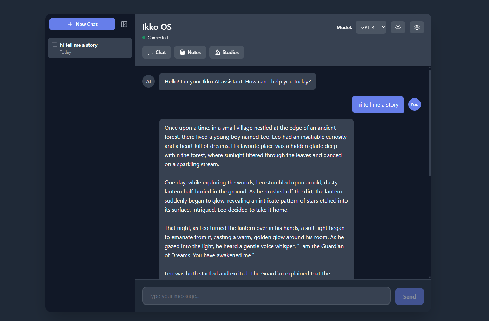

# iKKO Web Client (Unofficial)



An unofficial web client for iKKO, built through reverse engineering of the authentication flow and API.

## Disclaimer

**This is an independent research project and is NOT affiliated with, endorsed by, or connected to iKKO in any way.**

This project was created for:

- Educational purposes and personal use
- Understanding and documenting the iKKO API
- Interoperability with iKKO services

Use at your own risk. The authors are not responsible for any consequences of using this software.

## Known Limitations

- This client may break at any time if iKKO changes their API.
- Not all features of the official app may be supported.

## Getting Started

1. Install dependencies:

   ```bash
   npm install
   ```

2. Run the development server:

   ```bash
   npm run dev
   ```

3. Open [http://localhost:3000](http://localhost:3000) in your browser.

## Configuration

You'll need the following credentials from your iKKO device. Enter them in the Settings modal within the app.

### Required Credentials

| Field             | How to Get It              |
| ----------------- | -------------------------- |
| **Email**         | Your iKKO account email    |
| **Password**      | Your iKKO account password |
| **IMEI**          | See below                  |
| **Serial Number** | See below                  |

### Getting IMEI

**Option 1: Via ADB**

```bash
adb shell getprop sys.skyroam.silver.sim1
```

**Option 2: Via Android UI**

**Settings** → **About Phone** → **IMEI (sim slot 1)**

### Getting Serial Number

**Option 1: Via ADB**

```bash
adb shell getprop ro.serialno
```

**Option 2: Check device list**

The serial number also appears in `adb devices` output:

```bash
adb devices
# Output: IKMBXXXXXXXXXX    device
#         ^^^^^^^^^^^^^^ this is the serial number
```

## Tech Stack

- [Next.js](https://nextjs.org) - React framework
- [Tailwind CSS](https://tailwindcss.com) - Styling
- [Lucide React](https://lucide.dev) - Icons
